# 🚙⚡ Mobilis

> **A Soroban-Powered Automated Micro-Credit Treasury and Non-Custodial Liquidity Routing Infrastructure for Unbanked Transport Drivers and Commuters in the Philippines.**

<p align="center">
  
</p>

## 📖 Problem & Solution

### The Real-World Problem
According to recent public transport and macroeconomic research in the Philippines, **over 70% of tricycle, jeepney, and modernized transport operators remain entirely unbanked** or underserved by formal banking institutions. Operating on daily micro-margins, these essential transport workers lack liquid capital to afford upfront morning fuel costs. 

To bridge this daily gap, drivers are systemically forced to rely on predatory local informal lending networks—historically known as **"5-6" loan structures**—which trap drivers in a cycle of perpetual debt by imposing annualized interest percentages exceeding **200% APR**. Consequently, up to **30-40% of a driver's daily take-home earnings** is extracted by informal lenders simply to maintain route operations.

### The Mobilis Infrastructure Solution
Mobilis introduces an automated, Web3 high-efficiency liquidity framework powered by **Stellar and Soroban Smart Contracts**. Local transport cooperatives and **TODAs** (Tricycle Operators and Drivers' Associations) establish decentralized, non-custodial treasuries.

With **Mobilis**, commuters can now discover nearby drivers on a real-time radar UI and pay transport fares directly using instant, micro-fee Stellar payments.

---

## ✅ Submission Checklist & Requirements Met

- [x] **Public GitHub repository:** Complete open-source code availability.
- [x] **README with complete documentation:** Detailed configuration structure finalized.
- [x] **Minimum 10+ meaningful commits:** Maintained consistently throughout development.
- [x] **Live demo link:** [Mobilis Web App](https://mobilis-10f9a.web.app/)
- [x] **Contract deployment address:** `CAVFLXBG4MXGTGECI6WAZXMDNX2H3UWFTMNY4DHK2MR4YUYEEU5STBID`
- [x] **Advanced smart contract development:** Rust-based Soroban contracts managing immutable debt states and trustless fee-splitting.
- [x] **Inter-contract communication / Token Transfers:** Direct interactions handling native Stellar core asset operations and programmatic fee dispersion.
- [x] **Event streaming & real-time updates:** High-performance RPC and Horizon balance state fetches coupled with live updates via Firebase Firestore listeners.
- [x] **Commuter Onboarding & Wallet Provisioning:** Automated Stellar wallet generation for commuters requiring only Name, Email, and Password.
- [x] **Driver Presence (GPS Duty Tracking):** Drivers toggle "Go On Duty" to broadcast live GPS location to Firestore using `navigator.geolocation.watchPosition()` with battery movement thresholding.
- [x] **Nearby Driver Discovery (Radar UI):** Animated circular pulse radar, search radius selector (1, 3, 5, 10 km), distance sorting (Haversine formula), and empty/loading state fallbacks.
- [x] **Direct Stellar Fare Payments:** Commuters send direct Stellar XLM payments to drivers with instant PHP conversion and pre-flight balance checks.
- [x] **Transit Ledger (Ride History):** Real-time history page displaying fare receipts and contract transactions with direct links to StellarExpert testnet explorer.
- [x] **Driver Real-Time Alerts:** Web Audio API synthesized double chime (`AudioContext` / `OscillatorNode`), animated in-app toast banner, and native browser notifications on payment arrival.
- [x] **Firebase Cloud Messaging (FCM):** Background push notification service worker (`firebase-messaging-sw.js`) and token registration.
- [x] **Mobile responsive frontend:** Tailwind CSS implementation with an app-like bottom navigation container designed for transport operators on mobile units.
- [x] **Error handling & loading states:** Transaction validation rules, balance safety checks, and deterministic transaction signing blocks.
- [x] **Production-ready architecture practices:** Clear separation of off-chain metadata (Firebase) and on-chain transactional proofs (Stellar Ledger).

---

## 🚀 Live Links & Proof of Deployment

* **Live Platform Demo:** [https://mobilis-10f9a.web.app/](https://mobilis-10f9a.web.app/)
* **Testnet Contract Address:** `CAVFLXBG4MXGTGECI6WAZXMDNX2H3UWFTMNY4DHK2MR4YUYEEU5STBID`

### On-Chain Transaction Verification

| Action Log | Transaction Hash / Explorer Link | Ledger Verification |
| :--- | :--- | :--- |
| **Initial Funding** | [64d87c59f1d0...](https://stellar.expert/explorer/testnet/tx/64d87c59f1d037475199dfd8e56425cf7a9dc0b183ab6da6838b961eb1dcd481) |  |
| **Loan Advance** | [fc0766df376f...](https://stellar.expert/explorer/testnet/tx/fc0766df376f13ca3b1e5e4583fe7c01738a244206d30269dd8912bb0ccd1d5a) |  |
| **Debt Settlement** | [1ab1a0a09207...](https://stellar.expert/explorer/testnet/tx/1ab1a0a09207bbaefda4f8f696866c43eed23995904303d063cb52c0e13994d3) |  |
| **Fee Routing** | [702d83033adc...](https://stellar.expert/explorer/testnet/tx/702d83033adcdc63375368ab6292b9e5e44a24fba01a8b206e542cf516faf331) |  |

---

## 📸 System Evidence & UI Presentation

### 🛺 Driver Operational UI Suite (Verified Mobile Views)

| Driver Dashboard (Radar & Dispatch Queue) | Driver Digital Wallet (Soroban Vault) |
| :---: | :---: |
| 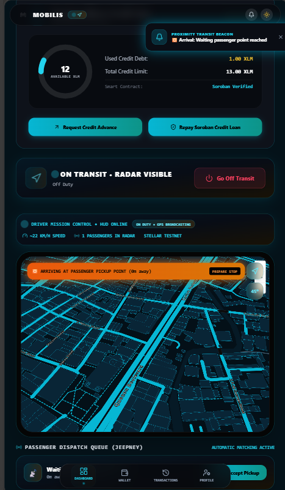 | 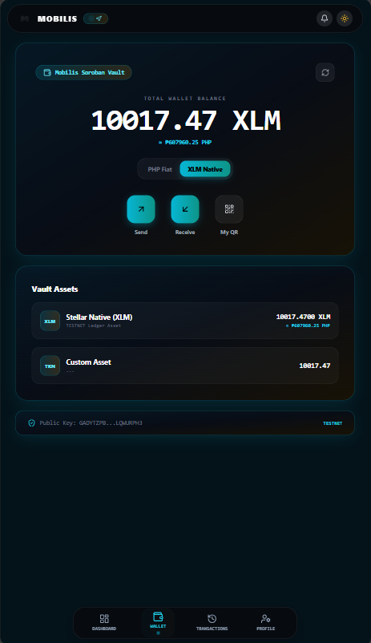 |

| Driver Transactions (Fare Receipts) | Driver Profile & Transport Vehicle |
| :---: | :---: |
| 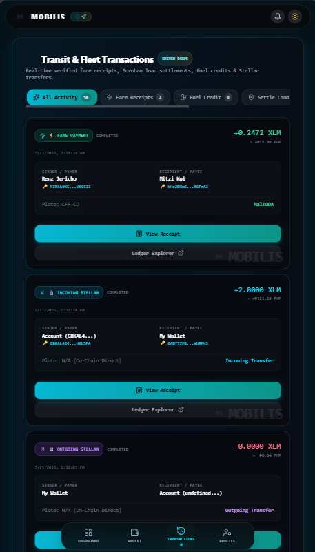 | 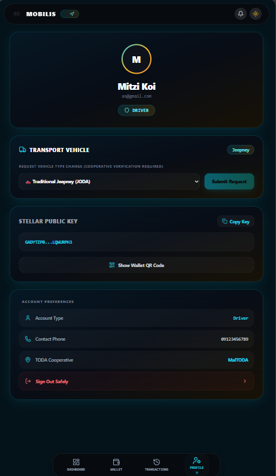 |

### 🧍‍♂️ Commuter Transit UI Suite (Verified Mobile Views)

| Commuter Radar (Live Vector Map & Filters) | Commuter Soroban Vault (Wallet) |
| :---: | :---: |
| 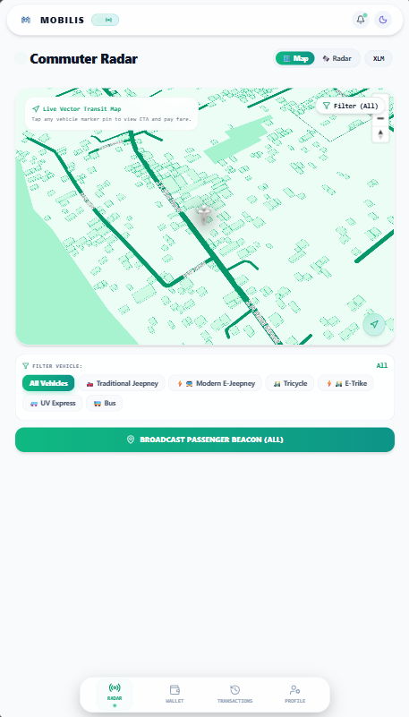 | 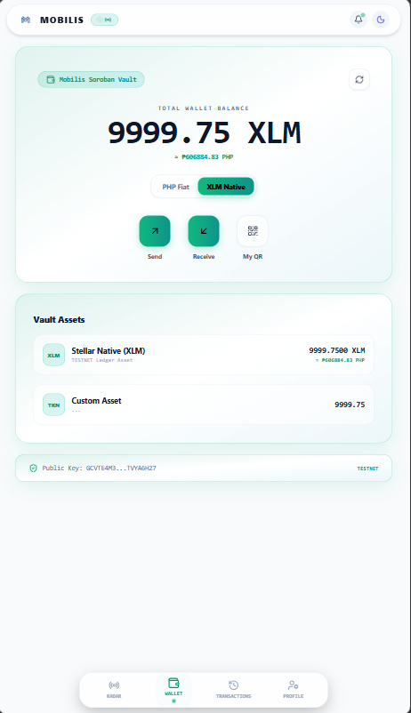 |

| Commuter Transactions (Fare History) | Commuter Profile & Security |
| :---: | :---: |
| 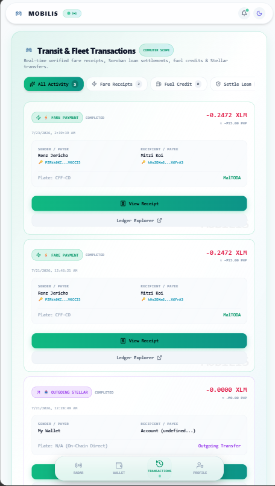 | 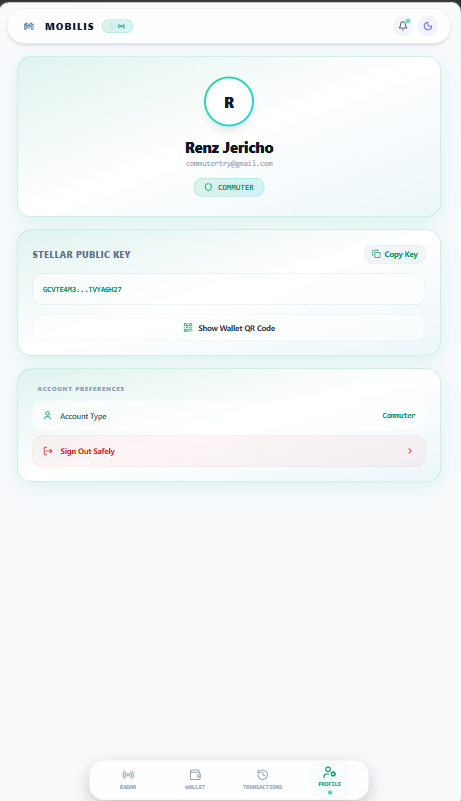 |

### 🏢 Cooperative Treasury UI Suite (Verified Mobile Views)

| Coop Dashboard & Member Queue | Coop Soroban Vault (Coop Treasury) |
| :---: | :---: |
| 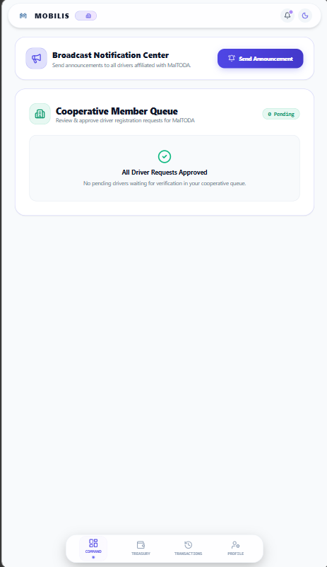 | 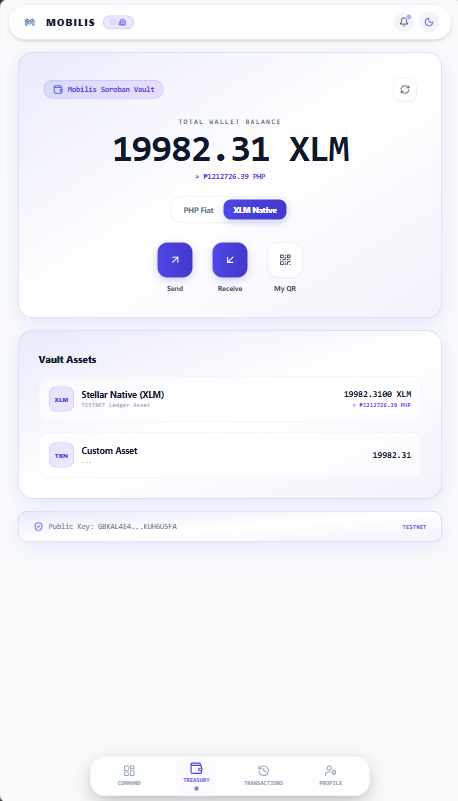 |

| Coop Transactions (Fuel Advances & Loans) | Coop Profile & Settings |
| :---: | :---: |
| 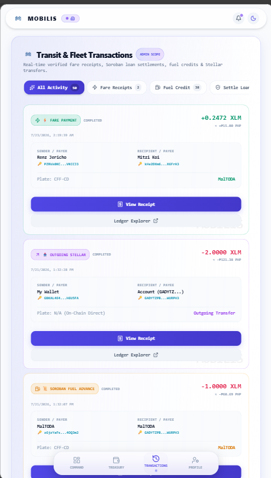 | 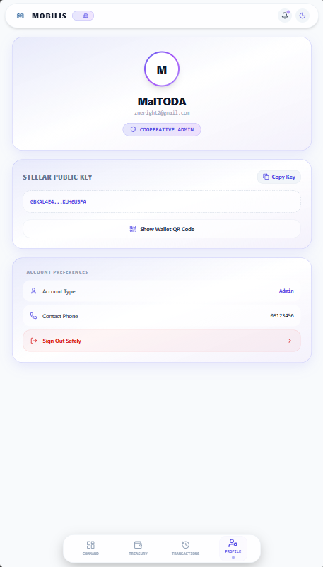 |

---

### CI/CD Deployment Pipeline & Test Suite Performance


---

## 🗄️ Firestore Database Schema

```typescript
// users/{uid}
interface UserData {
  uid: string;
  email: string;
  role: 'driver' | 'admin' | 'superadmin' | 'commuter';
  status: 'pending' | 'approved' | 'rejected';
  publicKey: string;
  secret: string;
  fullName?: string;
  plateNumber?: string;
  todaAffiliation?: string;
  fcmToken?: string;
}

// driver_locations/{driverUid}
interface DriverLocationDoc {
  uid: string;
  publicKey: string;
  driverName: string;
  plateNumber: string;
  todaAffiliation: string;
  lat: number;
  lng: number;
  active: boolean;
  updatedAt: string;
}

// fare_transactions/{autoId}
interface FareTransaction {
  txHash: string;
  driverId: string;
  driverName: string;
  driverPublicKey: string;
  commuterId: string;
  commuterName: string;
  commuterPublicKey: string;
  amount: string;
  amountPhp: string;
  timestamp: string;
  status: 'completed';
  type: 'fare_payment';
}
```

---

## 💻 Local Development & Testing Instructions

### Prerequisites
* **Node.js & npm** (v18+)
* **Rust toolchain** (`rustup target add wasm32-unknown-unknown`)
* **Soroban CLI** (`cargo install --locked soroban-cli`)

### 1. Smart Contract Compilation & Verification
```bash
cd contracts/Mobilis
# Run unit assertions verifying contract actions (3+ passing tests)
cargo test
```

### 2. Frontend Workspace System Initialization
```bash
cd ../../mobilis-frontend
npm install

# Copy environment variables template
cp .env.example .env

# Fire up local development server
npm run dev
```

### 3. Verify Production Build & TypeScript Types
```bash
# Run TypeScript compilation & Vite production build
npm run build
```

---

## 🔒 Security & Performance Guardrails

- **Zero MP3 Audio Assets:** Web Audio API (`AudioContext` / `OscillatorNode`) synthesizes dual-tone chime locally with zero network overhead.
- **Battery & GPS Movement Thresholding:** Geolocation updates are published only when driver position shifts > 10 meters or after 30 seconds to conserve mobile battery.
- **Pre-Flight Asset Assurances:** The UI prevents double-borrowing and double-spending by verifying available XLM and smart contract debt mappings via pre-flight simulations.
- **Dynamic Fee Allocation:** Upon repayment, fees are programmatically routed across structural accounts (0.3% to Coop Admins for risk mitigation, 0.2% to Platform core maintenance).
- **Fail-Safe Cryptography:** Wallet actions utilize loading state overlays, intercepting user mistakes and handling runtime ledger rejections cleanly.
