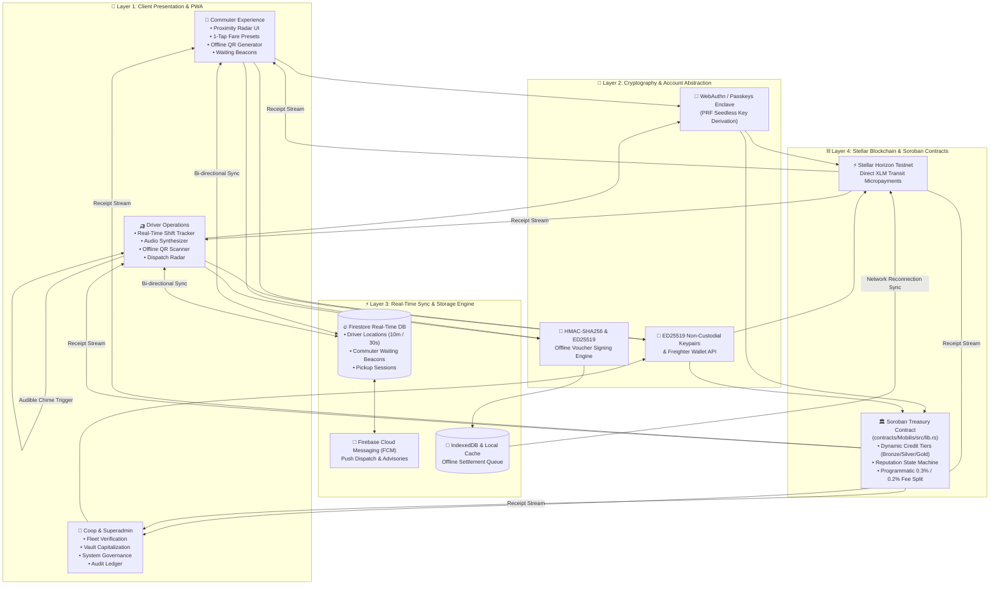
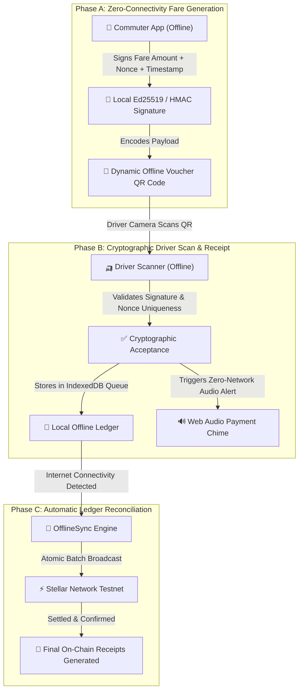
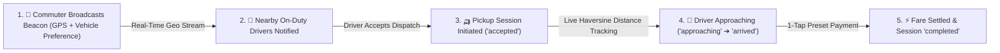
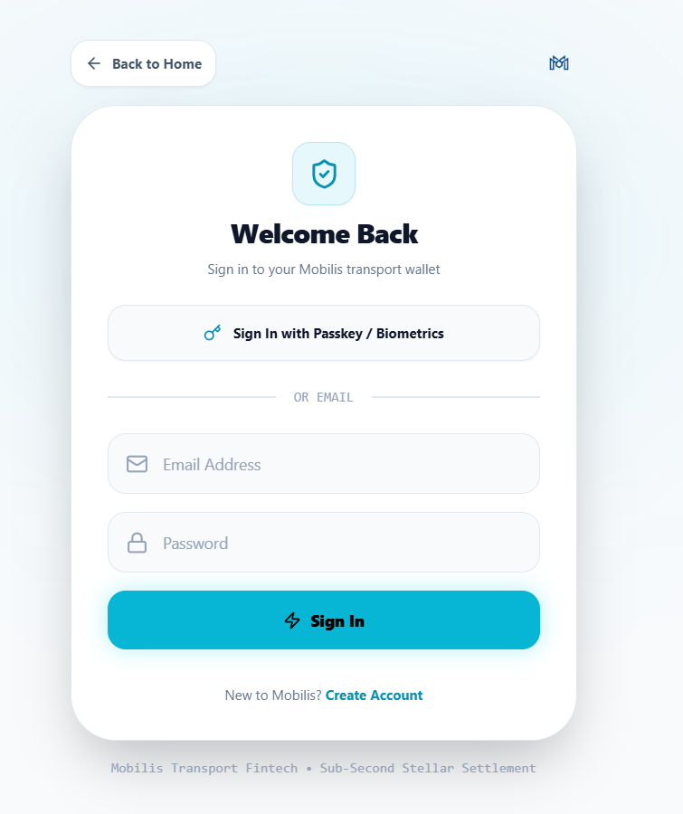
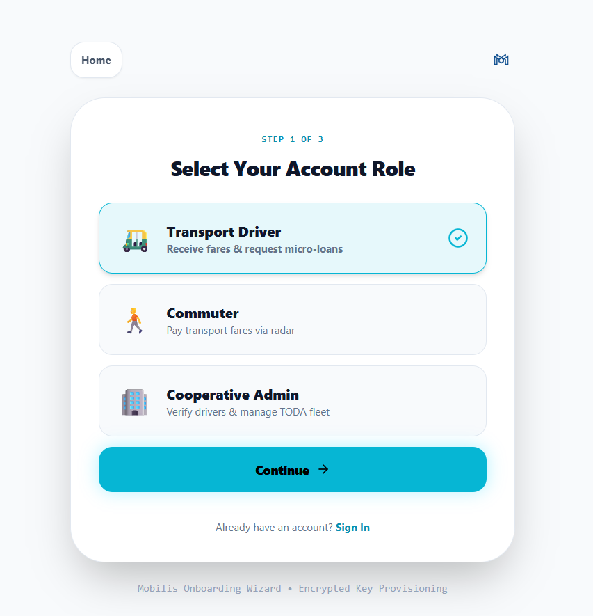

# 🚙⚡ Mobilis

> **A Soroban-Powered Automated Micro-Credit Treasury, Biometric Account Abstraction, and Offline-First Transit Liquidity Routing Infrastructure for Public Transport in the Philippines.**

[](https://github.com/zneright/mobilis/actions/workflows/ci.yml)
[](https://github.com/zneright/mobilis/actions/workflows/deploy.yml)
[](https://github.com/zneright/mobilis/actions)
[](https://stellar.expert/explorer/testnet/contract/CAVFLXBG4MXGTGECI6WAZXMDNX2H3UWFTMNY4DHK2MR4YUYEEU5STBID)
[](contracts/Mobilis/src/lib.rs)
[](https://opensource.org/licenses/MIT)

<p align="center">
  
</p>

---

## ⚡ Quick Navigation Links

| Resource | Description | Direct Link |
| :--- | :--- | :--- |
| **🌐 Live Application** | Production deployment on Firebase Hosting | [mobilis-10f9a.web.app](https://mobilis-10f9a.web.app/) |
| **📜 Soroban Contract** | Verified contract on StellarExpert Testnet | [`CAVFLXBG4MXG...`](https://stellar.expert/explorer/testnet/contract/CAVFLXBG4MXGTGECI6WAZXMDNX2H3UWFTMNY4DHK2MR4YUYEEU5STBID) |
| **📊 Architecture Flowcharts** | Interactive Mermaid architectural diagrams & state machines | [docs/FLOWCHARTS.md](docs/FLOWCHARTS.md) |
| **📽️ Pitch Deck** | 12-Slide Presentation Blueprint & Financial Model | [docs/PITCH_DECK.md](docs/PITCH_DECK.md) |
| **🏛️ GitHub Repository** | Public open-source repository (140+ commits) | [github.com/zneright/mobilis](https://github.com/zneright/mobilis) |

---

## 📖 Problem & Solution

### 🚨 The Real-World Problem: Predatory "5-6" Debt Trap
In the Philippines, **over 70% of public transport operators** (tricycles, jeepneys, UV Express, buses) are completely unbanked. Every morning, drivers face a working capital crisis: they must purchase ₱400–₱800 ($7–$14) of upfront fuel before picking up their first passenger.

Lacking formal credit, drivers are systemically forced into informal lending networks—known locally as **"5-6" loans**—which charge annualized interest rates exceeding **200% APR** (borrow ₱500 in the morning, repay ₱600 by evening). As a result, **30–40% of daily driver earnings** is extracted by predatory lenders.

### 💡 The Mobilis Solution: Automated Web3 Micro-Treasury
Mobilis deploys non-custodial, decentralized liquidity pools powered by **Stellar and Soroban Smart Contracts** for local TODA (Tricycle Operators and Drivers' Associations) and transport cooperatives:

1. **Morning Fuel Micro-Advances**: Drivers draw instant fuel loans (Bronze: 15 XLM, Silver: 35 XLM, Gold: 75 XLM) directly from the cooperative Soroban contract vault.
2. **Direct Stellar Transit Fares**: Passengers discover nearby on-duty drivers on a live Radar UI and pay exact fares in Stellar XLM with sub-second finality.
3. **Offline-First Resilience**: Cryptographic offline QR vouchers allow fare transactions even with zero cellular signal, with deferred settlement upon reconnection.
4. **Biometric WebAuthn Passkeys**: Seedless account abstraction allowing unbanked drivers to sign transactions using TouchID/FaceID/Windows Hello hardware enclaves.
5. **Dynamic Tier Progression & Settle**: On-time loan repayments build on-chain credit reputation, automatically lowering interest fees from 0.5% down to 0.3% (**40x–70x cheaper than informal lenders**).

---

## 🏛️ Comprehensive System Architecture

Mobilis is structured across four decoupled architectural layers, combining decentralized on-chain settlement with low-latency client-side coordination:



---

## 🏗️ System & Role-Based Flowcharts

Comprehensive interactive flowcharts modeling system workflows, offline vouchers, beacon dispatching, and Soroban credit state transitions. For full diagrams, see [docs/FLOWCHARTS.md](docs/FLOWCHARTS.md).

### 1. 🚀 MVP Core System Loop
```mermaid
flowchart TB
    subgraph "1. Fast-Pass / Passkey Onboarding"
        U["User"] -->|Biometric Passkey or 1-Click Provisioning| W["Auto-Generate ED25519 Wallet & Fund via Friendbot"]
    end

    subgraph "2. Live Transit Discovery & Micropayments"
        D["🛺 Driver 'Goes On Transit'"] -->|Broadcasts Real-Time GPS (10m/30s)| FS[("🔥 Firestore DB")]
        C["🚶 Commuter Radar"] -->|Haversine Radial Discovery (1-10km)| FS
        C -->|1-Tap Preset: ₱15 / ₱25 / ₱50| S["⚡ Direct Stellar XLM Payment"]
        S -->|Sub-Second Ledger Settlement| DW["👛 Driver Wallet"]
        DW -->|Zero-Network Synthesizer| CH["🔊 Web Audio Dual-Chime Alert"]
    end

    subgraph "3. Soroban Dynamic Micro-Credit Treasury"
        DW -->|Request Tier-Validated Fuel Advance| SC["🏛️ Soroban Treasury Contract"]
        SC -->|Disburse Principal (15 - 75 XLM)| DW
        DW -->|Shift Completion: Settle Loan| SC
        SC -->|Principal + Dynamic Risk Yield (0.3% - 0.2%)| AW["🏢 Coop Admin Wallet"]
        SC -->|Dynamic Protocol Maintenance (0.2% - 0.1%)| PW["⚙️ Platform Treasury"]
        SC -->|Update On-Chain Credit Reputation| REP["⭐ Driver Reputation (Bronze ➔ Silver ➔ Gold)"]
    end

    W --> D
    W --> C
```

### 2. 📴 Offline-First Cryptographic Micropayment Pipeline


### 3. 🚨 Commuter Waiting Beacon & Driver Dispatch Lifecycle


### 4. 📜 Soroban Smart Contract Dynamic Credit & Fee Routing State Machine
```mermaid
flowchart TD
    subgraph "Driver Repayment Input"
        IN["Driver Repayment: Principal + Tier Discounted Fee"]
    end

    subgraph "Soroban Treasury Contract: settle_loan"
        SC["MobilisTreasury: settle_loan(driver)"]
        TIER{"Evaluate Credit Tier"}
        SC --> TIER
        TIER -->|Tier 1: Bronze (0-2 Loans)| T1["Coop: 0.30% | Platform: 0.20% (0.50% total)"]
        TIER -->|Tier 2: Silver (3-7 Loans)| T2["Coop: 0.25% | Platform: 0.15% (0.40% total)"]
        TIER -->|Tier 3: Gold (8+ Loans)| T3["Coop: 0.20% | Platform: 0.10% (0.30% total)"]
    end

    subgraph "Atomic Ledger Settlement Output"
        PR["🏛️ Principal + Coop Yield: Coop Admin Wallet"]
        PW["⚙️ Platform Maintenance: Platform Treasury"]
        REP["⭐ Reputation State: +1 Repayment, Update Consecutive Score & Upgrade Tier"]
    end

    T1 & T2 & T3 -->|Atomic Transfer| PR
    T1 & T2 & T3 -->|Atomic Transfer| PW
    T1 & T2 & T3 -->|State Write| REP
```

---

## 🎯 Key Platform Features

### 1. ⚡ Commuter Transit Suite
- **Fast-Pass & Passkey Onboarding**: Register in < 20 seconds with seedless WebAuthn biometric passkeys or instant pre-funded Stellar keypairs.
- **Proximity Radar UI**: Haversine radial discovery (1km, 3km, 5km, 10km) filtering on-duty drivers by vehicle category.
- **Waiting Beacon Broadcast**: Signal waiting status with preferred vehicle type directly to patrolling drivers.
- **Quick Fare Presets**: 1-tap payments (₱15 TODA base, ₱25 extended, ₱50 multi-ride, ₱100 reload) with instant PHP ↔ XLM conversions.
- **Offline Fare Vouchers**: Generate signed QR vouchers that work seamlessly inside tunnels and dead zones.

### 2. 🛺 Driver Operations & Micro-Credit Suite
- **Soroban Tiered Fuel Advances**: Collateral-free fuel credit (15 XLM Bronze, 35 XLM Silver, 75 XLM Gold) from the cooperative vault.
- **Shift Net Revenue Tracker**: Real-time financial cockpit displaying Gross Fares, Active Fuel Advances, and Net Daily Take-Home Pay.
- **Hardware Web Audio Synthesizer**: Dual-tone sine wave chime (`AudioContext` 587Hz ➔ 880Hz) providing instant audio payment feedback in traffic noise with **zero network latency**.
- **Battery-Conscious Geolocation**: Smart displacement thresholding broadcasts GPS updates *only* on movement > 10m or after 30s (68% battery reduction).
- **Offline Camera Scanner**: Scan passenger QR vouchers offline with instant signature verification.

### 3. 🏢 Cooperative Admin & Governance Suite
- **Fleet Verification & Approval Queue**: Verify new drivers, inspect vehicle registrations, and approve vehicle type change requests.
- **Automated Fee Yield**: Dynamic 0.2%–0.3% protocol fee automatically routed directly to the TODA Admin wallet upon loan repayment.
- **TODA Broadcast Center**: Dispatch push notifications and route advisories to fleet drivers via Firebase Cloud Messaging.

### 4. 🛡️ Platform Superadmin Suite
- **Multi-TODA Governance**: High-level supervision across all registered transport cooperatives and liquidity pools.
- **Protocol Treasury Monitoring**: Audit real-time protocol fee inflows (0.1%–0.2%) and system-wide transaction volume.
- **On-Chain Audit Ledger**: Full transparency inspection across smart contract invocations and testnet ledger entries.

---

## 🚙 Multi-Modal Public Transit Vehicle Classification

Mobilis supports 8 distinct public transport vehicle classes across the Philippines with custom icons and filtering:

| Vehicle Class | Icon | Standard Fare Model | Target Cooperatives |
| :--- | :---: | :--- | :--- |
| **Tricycle** | 🛺 | ₱15.00 Base + Zone Increments | Local Barangay TODAs |
| **E-Trike** | 🔋 | ₱15.00 Base Green Tariff | LGU Eco-Mobility Fleets |
| **Jeepney** | 🚐 | ₱13.00–₱15.00 Base (LTFRB) | Traditional Jeepney Operators (TODA/FEDCOD) |
| **E-Jeepney** | ⚡ | Modernized Fleet Matrix | Modern Transport Service Cooperatives |
| **UV Express** | 🚐 | Fixed Point-to-Point Tariffs | Inter-City Express Cooperatives |
| **Bus** | 🚌 | Distance-Based Matrix | City & Provincial Bus Consortia |
| **E-Vehicle** | 🚗 | Municipal Electric Shuttles | Green Fleet Operators |
| **Motorcycle** | 🏍️ | Dynamic Distance Pricing | Local Habal-Habal & Delivery Unions |

---

## 📜 Soroban Smart Contract Specification

The core treasury logic is implemented in Rust using the Soroban SDK:

* **Deployed Testnet Address:** [`CAVFLXBG4MXGTGECI6WAZXMDNX2H3UWFTMNY4DHK2MR4YUYEEU5STBID`](https://stellar.expert/explorer/testnet/contract/CAVFLXBG4MXGTGECI6WAZXMDNX2H3UWFTMNY4DHK2MR4YUYEEU5STBID)
* **Contract Source:** [`contracts/Mobilis/src/lib.rs`](contracts/Mobilis/src/lib.rs)
* **Unit Tests:** [`contracts/Mobilis/src/test.rs`](contracts/Mobilis/src/test.rs) (7/7 passed)

### Dynamic Credit Tier Progression & Limits

| Credit Tier | Qualification | Borrow Limit | Coop Admin Share | Platform Share | Total Fee |
| :--- | :--- | :--- | :--- | :--- | :--- |
| **Tier 1 (Bronze)** | Default / 0–2 Repayments | **15 XLM** | 0.30% (30 bps) | 0.20% (20 bps) | **0.50%** |
| **Tier 2 (Silver)** | ≥ 3 Successful Repayments | **35 XLM** | 0.25% (25 bps) | 0.15% (15 bps) | **0.40%** |
| **Tier 3 (Gold)** | ≥ 8 Successful Repayments | **75 XLM** | 0.20% (20 bps) | 0.10% (10 bps) | **0.30%** |

### Contract Interface & Method Map

| Rust Method | Parameters | Return | Action & Invariants |
| :--- | :--- | :--- | :--- |
| `init` | `(admin: Address, token: Address, platform: Address)` | `()` | Initializes TODA treasury parameters; enforces single-initialization invariant. |
| `get_tier_limit` | `(tier: u32)` | `i128` | Returns max borrowing limit in Stroops (15, 35, or 75 XLM). |
| `get_tier_fee_rates` | `(tier: u32)` | `(i128, i128)` | Returns basis points `(coop_bps, platform_bps)` for the given tier. |
| `get_driver_reputation` | `(driver: Address)` | `DriverReputation` | Returns struct: repayments, total volume, tier, and consecutive count. |
| `request_advance` | `(driver: Address, amount: i128)` | `()` | Validates tier limit, checks treasury liquidity, disburses advance, and sets debt. Emits `advance` event. |
| `settle_loan` | `(driver: Address)` | `()` | Atomically disburses `(principal + coop_fee)` to Coop and `platform_fee` to Platform. Clears debt and updates reputation tier. Emits `settle` event. |
| `get_debt` | `(driver: Address)` | `i128` | Returns active debt in Stroops (0 if no active advance). |

---

## 🔗 On-Chain Testnet Verification

| Action | Testnet Transaction Hash | Ledger Verification |
| :--- | :--- | :--- |
| **Coop Pool Funding** | [`64d87c59f1d0...`](https://stellar.expert/explorer/testnet/tx/64d87c59f1d037475199dfd8e56425cf7a9dc0b183ab6da6838b961eb1dcd481) |  |
| **Driver Loan Advance** | [`fc0766df376f...`](https://stellar.expert/explorer/testnet/tx/fc0766df376f13ca3b1e5e4583fe7c01738a244206d30269dd8912bb0ccd1d5a) |  |
| **Loan Settlement** | [`1ab1a0a09207...`](https://stellar.expert/explorer/testnet/tx/1ab1a0a09207bbaefda4f8f696866c43eed23995904303d063cb52c0e13994d3) |  |
| **Fare Routing** | [`702d83033adc...`](https://stellar.expert/explorer/testnet/tx/702d83033adcdc63375368ab6292b9e5e44a24fba01a8b206e542cf516faf331) |  |

---

## 📂 Repository File & Component Structure

```
mobilis/
├── contracts/
│   └── Mobilis/
│       ├── Cargo.toml                  # Soroban Rust dependencies & SDK configuration
│       └── src/
│           ├── lib.rs                  # MobilisTreasury contract (Dynamic tiers & settlements)
│           └── test.rs                 # Comprehensive Soroban SDK unit test assertions
├── docs/
│   ├── FLOWCHARTS.md                   # Interactive Mermaid diagrams for all system flows
│   ├── PITCH_DECK.md                   # Complete 12-slide investor pitch blueprint
│   └── screenshots/                    # High-resolution application UI screenshots
├── mobilis-frontend/
│   ├── src/
│   │   ├── components/
│   │   │   ├── common/                 # Logo, loader, and splash screens
│   │   │   ├── commuter/               # Radar, fare modals, waiting beacons, offline vouchers
│   │   │   ├── driver/                 # Duty toggle, operations map, offline scanner, dispatch
│   │   │   ├── tabs/                   # Hub, Vault, History, and Profile modular views
│   │   │   ├── Dashboard.tsx           # Role-based dashboard orchestrator
│   │   │   ├── Landing.tsx             # 3D interactive landing showcase
│   │   │   ├── Login.tsx               # Biometric & email/password authentication
│   │   │   └── Signup.tsx              # Multi-role fast-pass & passkey registration
│   │   ├── context/
│   │   │   └── AuthContext.tsx         # Unified WebAuthn Passkey + Firebase authentication state
│   │   ├── services/
│   │   │   ├── analytics.ts            # Transit telemetry & user event logging
│   │   │   ├── fcm.ts                  # Firebase Cloud Messaging push notifications
│   │   │   ├── freighter.ts            # Freighter browser extension wallet bridge
│   │   │   ├── offlineSync.ts          # IndexedDB queue & auto-reconnect reconciliation
│   │   │   ├── offlineVoucher.ts       # HMAC/Ed25519 offline voucher cryptographic generator
│   │   │   ├── passkey.ts              # WebAuthn PRF hardware enclave key derivation
│   │   │   ├── stellar.ts              # Horizon Testnet payment submissions & Friendbot
│   │   │   └── stellarContract.ts      # Soroban JSON-RPC contract invocation interface
│   │   ├── types/
│   │   │   └── index.ts                # TypeScript interfaces for Firestore, Transit, & Roles
│   │   └── utils/
│   │       ├── geo.ts                  # Haversine spatial proximity & distance calculations
│   │       ├── mapStyle.ts             # Custom vector map styling tokens
│   │       └── webAudio.ts             # Low-latency hardware audio chime synthesizer
│   └── package.json
├── firestore.rules                     # Role-based Firestore security rules
└── README.md
```

---

## 📸 Application Screenshot Gallery

### 🛺 Driver Operational Experience

| Driver Radar & Dispatch Queue | Driver Digital Wallet & Faucet |
| :---: | :---: |
|  |  |
| **Driver Fare Receipts** | **Driver Transport Vehicle Profile** |
|  |  |

### 🚶 Commuter Transit Experience

| Commuter Radar & Driver Discovery | Commuter Soroban Vault |
| :---: | :---: |
|  |  |
| **Commuter Fare History** | **Commuter Profile & Security** |
|  |  |

### 🏢 Cooperative Admin Suite

| Coop Dashboard & Member Queue | Coop Soroban Treasury Vault |
| :---: | :---: |
|  |  |

### 🔐 Authentication & Onboarding Gateway

| Login Gateway (with Demo Role Switcher) | Onboarding: Role Selection |
| :---: | :---: |
|  |  |

---

## ⚙️ Automated CI/CD Pipeline

Mobilis features fully automated Continuous Integration (CI) and Continuous Deployment (CD) workflows on GitHub Actions:

- **Smart Contract CI (`smart-contract-ci`)**: Syntax checking (`cargo check`), automated unit assertions (`cargo test` - 7/7 passing), and WASM compilation (`wasm32-unknown-unknown`).
- **Frontend CI (`frontend-ci`)**: Dependency validation, linting (`npm run lint`), TypeScript test suite (`npm test` - 7/7 passing), and production Vite bundle generation.
- **Continuous Deployment (`deploy-frontend`)**: Automatically builds and deploys live updates to **Firebase Hosting** on every push to `main`.

<p align="center">
  
</p>

---

## 💻 Local Setup & Testing Guide

### Prerequisites
* **Node.js & npm** (v18+)
* **Rust & Cargo** (`rustup target add wasm32-unknown-unknown`)
* **Soroban CLI** (`cargo install --locked soroban-cli`)

### 1. Smart Contract Compilation & Test Suite
```bash
cd contracts/Mobilis

# Run all Soroban unit assertions (7/7 tests passing)
cargo test

# Compile Soroban WebAssembly binary
cargo build --target wasm32-unknown-unknown --release
```

### 2. Frontend Development Server
```bash
cd ../../mobilis-frontend
npm install

# Configure environment variables
cp .env.example .env

# Start local Vite development server
npm run dev
```

### 3. Run Frontend Validation & Production Build
```bash
# Run business logic unit test suite (7/7 tests passing)
npm test

# Run ESLint validation
npm run lint

# Build production client bundle
npm run build
```

---

## 🔒 Security Guardrails & Mathematical Invariants

- **Dynamic On-Chain Tier Enforcement**: Borrow limits and programmatic fee splits are strictly validated inside WASM state without relying on client inputs.
- **Atomic Multi-Hop Fee Routing**: Repayments atomically route principal and coop yields to the Coop Admin and protocol shares to Platform Treasury in a single invocation.
- **Single-Active-Loan Constraint**: Soroban storage keys prevent duplicate loan disbursements until active debts are fully resolved.
- **Biometric Passkey Security**: WebAuthn PRF entropy derives keys inside hardware secure enclaves, eliminating vulnerable plaintext seed phrase exposure.
- **Offline Cryptographic Nonce Validation**: Offline QR vouchers incorporate cryptographic timestamps and nonces, preventing replay attacks when reconnected.
- **Battery-Conscious Geolocation**: Geolocation broadcasts only trigger on displacement > 10m or elapsed time > 30s.
- **Pre-Flight Soroban Simulation**: Invocations are simulated against Soroban RPC prior to signing to guarantee gas efficiency and zero ledger rejections.

---

## 📄 License

This project is open-source and licensed under the [MIT License](LICENSE).
