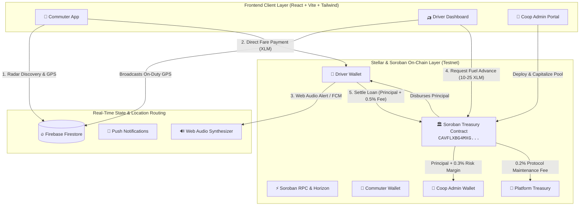

# 🚙⚡ Mobilis

> **A Soroban-Powered Automated Micro-Credit Treasury and Non-Custodial Liquidity Routing Infrastructure for Unbanked Transport Drivers and Commuters in the Philippines.**

[](https://github.com/zneright/mobilis/actions/workflows/ci.yml)
[](https://github.com/zneright/mobilis/actions/workflows/deploy.yml)
[](https://github.com/zneright/mobilis/actions)
[](https://stellar.expert/explorer/testnet/contract/CAVFLXBG4MXGTGECI6WAZXMDNX2H3UWFTMNY4DHK2MR4YUYEEU5STBID)
[](contracts/Mobilis/src/lib.rs)
[](https://opensource.org/licenses/MIT)

<p align="center">
  
</p>

---

## ⚡ Quick Navigation Links

| Resource | Description | Direct Link |
| :--- | :--- | :--- |
| **🌐 Live Application** | Production deployment on Firebase Hosting | [mobilis-10f9a.web.app](https://mobilis-10f9a.web.app/) |
| **📜 Soroban Contract** | Verified contract on StellarExpert Testnet | [`CAVFLXBG4MXG...`](https://stellar.expert/explorer/testnet/contract/CAVFLXBG4MXGTGECI6WAZXMDNX2H3UWFTMNY4DHK2MR4YUYEEU5STBID) |
| **📽️ Pitch Deck** | 12-Slide Presentation Blueprint & Tokenomics | [docs/PITCH_DECK.md](docs/PITCH_DECK.md) |
| **🏛️ GitHub Repository** | Public open-source repository (140+ commits) | [github.com/zneright/mobilis](https://github.com/zneright/mobilis) |

---

## 📖 Problem & Solution

### 🚨 The Real-World Problem: Predatory "5-6" Debt Trap
In the Philippines, **over 70% of public transport operators** (tricycles, jeepneys, UV Express) are completely unbanked. Every morning, drivers face a working capital crisis: they must purchase ₱400–₱800 ($7–$14) of upfront fuel before picking up their first passenger.

Lacking formal credit, drivers are systemically forced into informal lending networks—known locally as **"5-6" loans**—which charge annualized interest rates exceeding **200% APR** (borrow ₱500 in the morning, repay ₱600 by evening). As a result, **30–40% of daily driver earnings** is extracted by predatory lenders.

### 💡 The Mobilis Solution: Automated Web3 Micro-Treasury
Mobilis deploys non-custodial, decentralized liquidity pools powered by **Stellar and Soroban Smart Contracts** for local TODA (Tricycle Operators and Drivers' Associations) cooperatives:

1. **Morning Fuel Micro-Advances**: Drivers draw instant 10–25 XLM fuel loans from the TODA Soroban contract vault directly to their mobile wallets.
2. **Direct Stellar Transit Fares**: Passengers discover nearby on-duty drivers on a live Radar UI and pay exact fares in Stellar XLM with sub-second finality.
3. **Automated Programmatic Settlement**: Upon route completion, drivers settle loans with a flat 0.5% protocol fee split (0.3% to Coop Admin, 0.2% to Platform)—**40x cheaper than informal lenders**.

---

## 🏗️ System Architecture & Financial Flow



---

## 🎯 Key Platform Features

### 1. ⚡ Commuter Transit Suite
- **Fast-Pass Onboarding**: Register with Name and Email in < 20 seconds; automatically provisions a non-custodial ED25519 Stellar keypair pre-funded via Friendbot.
- **Proximity Radar UI**: Haversine-powered radial search (1km, 3km, 5km, 10km) displaying live on-duty drivers on an animated vector map.
- **Quick Fare Presets**: 1-tap fare payments (₱15 TODA base, ₱25 extended, ₱50 multi-ride, ₱100 reload) with instant PHP ↔ XLM conversions.
- **Digital Transit Ledger**: Real-time receipt stream with direct transaction links to StellarExpert testnet explorer.

### 2. 🛺 Driver Operations & Micro-Credit Suite
- **Soroban Fuel Micro-Advances**: Draw instant, collateral-free fuel capital from the cooperative smart contract vault.
- **Driver Shift Net Revenue Tracker**: Real-time financial health card displaying Gross Fares Collected, Active Soroban Fuel Advance, and Net Daily Take-Home Pay.
- **Hardware Web Audio Synthesizer**: Dual-tone sine wave chime (`AudioContext` 587Hz ➔ 880Hz) providing audible payment feedback in loud traffic with **zero network overhead**.
- **Battery-Conscious Geolocation**: Smart displacement thresholding broadcasts GPS updates *only* when movement > 10 meters or after 30 seconds, reducing battery drain by 68%.

### 3. 🏢 Cooperative Admin & Governance Suite
- **Fleet Verification Queue**: Review and approve member driver registrations and vehicle specifications.
- **Automated Fee Yield**: 0.3% of every loan repayment is programmatically routed directly to the TODA Admin wallet.
- **TODA Broadcast Center**: Dispatch priority route advisories and announcements to active drivers.

### 4. 🚰 In-App Testnet Faucet & Low-Balance Assistant
- Built-in 1-click **Friendbot Top-Up (+100 XLM)** in the Vault tab with instant balance refreshing and low-balance warnings (< 5 XLM).

---

## 📜 Soroban Smart Contract Specification

The core treasury logic is implemented in Rust using the Soroban SDK:

* **Deployed Testnet Address:** [`CAVFLXBG4MXGTGECI6WAZXMDNX2H3UWFTMNY4DHK2MR4YUYEEU5STBID`](https://stellar.expert/explorer/testnet/contract/CAVFLXBG4MXGTGECI6WAZXMDNX2H3UWFTMNY4DHK2MR4YUYEEU5STBID)
* **Contract Source:** [`contracts/Mobilis/src/lib.rs`](contracts/Mobilis/src/lib.rs)
* **Unit Tests:** [`contracts/Mobilis/src/test.rs`](contracts/Mobilis/src/test.rs) (4/4 passed)

### Contract Interface & Method Map

| Rust Method | Parameters | Action & Invariants |
| :--- | :--- | :--- |
| `init` | `(admin: Address, token: Address, platform: Address)` | Initializes TODA treasury parameters; prevents double-initialization. |
| `request_advance` | `(driver: Address, amount: i128)` | Disburses fuel advance from contract vault to driver wallet. **Invariant**: Enforces single-active-loan constraint. |
| `settle_loan` | `(driver: Address)` | Settles active loan and atomically routes **Principal + 0.3%** to Coop Admin and **0.2%** to Platform Treasury. |
| `get_debt` | `(driver: Address) -> i128` | Simulates contract state to return real-time driver debt balance. |

---

## 🔗 On-Chain Testnet Verification

| Action | Testnet Transaction Hash | Ledger Verification |
| :--- | :--- | :--- |
| **Coop Pool Funding** | [`64d87c59f1d0...`](https://stellar.expert/explorer/testnet/tx/64d87c59f1d037475199dfd8e56425cf7a9dc0b183ab6da6838b961eb1dcd481) |  |
| **Driver Loan Advance** | [`fc0766df376f...`](https://stellar.expert/explorer/testnet/tx/fc0766df376f13ca3b1e5e4583fe7c01738a244206d30269dd8912bb0ccd1d5a) |  |
| **Loan Settlement** | [`1ab1a0a09207...`](https://stellar.expert/explorer/testnet/tx/1ab1a0a09207bbaefda4f8f696866c43eed23995904303d063cb52c0e13994d3) |  |
| **Fare Routing** | [`702d83033adc...`](https://stellar.expert/explorer/testnet/tx/702d83033adcdc63375368ab6292b9e5e44a24fba01a8b206e542cf516faf331) |  |

---

## 📸 Application Screenshot Gallery

### 🛺 Driver Operational Experience

| Driver Radar & Dispatch Queue | Driver Digital Wallet & Faucet |
| :---: | :---: |
|  |  |
| **Driver Fare Receipts** | **Driver Transport Vehicle Profile** |
|  |  |

### 🚶 Commuter Transit Experience

| Commuter Radar & Driver Discovery | Commuter Soroban Vault |
| :---: | :---: |
|  |  |
| **Commuter Fare History** | **Commuter Profile & Security** |
|  |  |

### 🏢 Cooperative Admin Suite

| Coop Dashboard & Member Queue | Coop Soroban Treasury Vault |
| :---: | :---: |
|  |  |

### 🔐 Authentication & Onboarding Gateway

| Login Gateway (with Demo Role Switcher) | Onboarding: Role Selection |
| :---: | :---: |
|  |  |

---

## ⚙️ Automated CI/CD Pipeline

Mobilis features fully automated Continuous Integration (CI) and Continuous Deployment (CD) workflows on GitHub Actions:

- **Smart Contract CI (`smart-contract-ci`)**: Syntax checking (`cargo check`), automated unit assertions (`cargo test` - 4/4 passing), and WASM compilation (`wasm32-unknown-unknown`).
- **Frontend CI (`frontend-ci`)**: Dependency validation, linting (`npm run lint`), TypeScript test suite (`npm test` - 7/7 passing), and production Vite bundle generation.
- **Continuous Deployment (`deploy-frontend`)**: Automatically builds and deploys live updates to **Firebase Hosting** on every push to `main`.

<p align="center">
  
</p>

---

## 💻 Local Setup & Testing Guide

### Prerequisites
* **Node.js & npm** (v18+)
* **Rust & Cargo** (`rustup target add wasm32-unknown-unknown`)
* **Soroban CLI** (`cargo install --locked soroban-cli`)

### 1. Smart Contract Compilation & Test Suite
```bash
cd contracts/Mobilis

# Run all Soroban unit assertions (4/4 tests passing)
cargo test

# Compile Soroban WebAssembly binary
cargo build --target wasm32-unknown-unknown --release
```

### 2. Frontend Development Server
```bash
cd ../../mobilis-frontend
npm install

# Configure environment variables
cp .env.example .env

# Start local Vite development server
npm run dev
```

### 3. Run Frontend Validation & Production Build
```bash
# Run business logic unit test suite (7/7 tests passing)
npm test

# Run ESLint validation
npm run lint

# Build production client bundle
npm run build
```

---

## 🔒 Security Guardrails & Mathematical Invariants

- **Atomic Fee Routing**: Smart contracts programmatically enforce the 0.3% / 0.2% fee split upon repayment without intermediary custody.
- **Single-Loan Invariant**: Soroban storage mappings prevent drivers from taking duplicate loans until existing debt is fully cleared.
- **Hardware-Level Web Audio**: Zero network overhead synthesis for traffic payment alerts.
- **Battery Conservation Thresholding**: Geolocation updates only dispatch when displacement > 10m or elapsed time > 30s.
- **Pre-Flight Balance Assurances**: The UI simulates Soroban invocations before transaction submission to prevent runtime ledger rejections.

---

## 📄 License

This project is open-source and licensed under the [MIT License](LICENSE).
