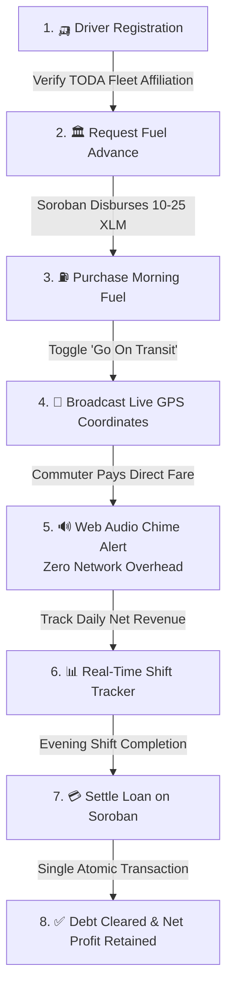
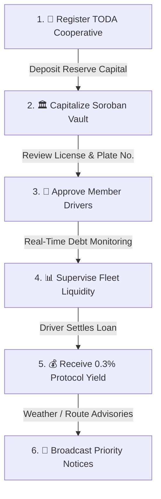
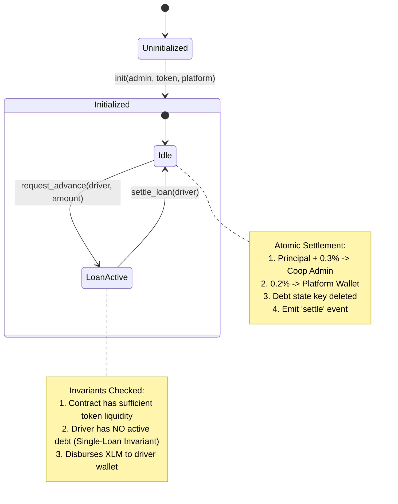

# 📊 Mobilis Architecture & Role-Based Flowcharts

> Comprehensive system, role-by-role user journeys, and Soroban smart contract state flowcharts for **Mobilis**.

---

## 🧭 Table of Contents
1. [MVP Core System Loop](#1-mvp-core-system-loop)
2. [Commuter Transit Journey](#2-commuter-transit-journey)
3. [Driver Operations & Micro-Credit Journey](#3-driver-operations--micro-credit-journey)
4. [Cooperative Admin Governance & Treasury Journey](#4-cooperative-admin-governance--treasury-journey)
5. [Soroban Smart Contract & Atomic Fee Routing State Machine](#5-soroban-smart-contract--atomic-fee-routing-state-machine)

---

## 1. 🚀 MVP Core System Loop

```mermaid
flowchart TB
    subgraph "1. Onboarding & Provisioning"
        U[User Enters App] -->|Fast-Pass| W[Auto-Generate Stellar Keypair & Fund via Friendbot]
    end

    subgraph "2. Live Transit Discovery & Micropayments"
        D[🛺 Driver 'Goes On Transit'] -->|Broadcasts GPS Location| FS[(Firestore DB)]
        C[🚶 Commuter Radar] -->|Haversine Filter < 1km| FS
        C -->|1-Tap Fare Preset: ₱15 / ₱25 / ₱50| S[⚡ Direct Stellar Payment (XLM)]
        S -->|Sub-Second Finality| DW[👛 Driver Wallet]
        DW -->|Triggers Zero-Network Synthesizer| CH[🔊 Hardware Web Audio Dual-Chime]
    end

    subgraph "3. Soroban Micro-Credit Treasury"
        DW -->|Requests 10-25 XLM Fuel Loan| SC[🏛️ Soroban Treasury Contract]
        SC -->|Disburses Morning Capital| DW
        DW -->|Evening: Settle Loan (Principal + 0.5%)| SC
        SC -->|Principal + 0.3% Risk Share| AW[🏢 Coop Admin Wallet]
        SC -->|0.2% Maintenance Fee| PW[⚙️ Mobilis Platform Treasury]
    end

    W --> D
    W --> C
```

---

## 2. 🚶 Commuter Transit Journey

```mermaid
flowchart LR
    A[1. 🚶 Fast-Pass Signup<br/>Name, Email, Password] -->|Automated Keypair Generation| B[2. 📡 Radar Discovery<br/>Live Map & Radius Selector]
    B -->|Haversine Proximity Sorting| C[3. 🛺 Select Driver<br/>View TODA Fleet & Vehicle]
    C -->|Choose ₱15 / ₱25 / ₱50 Preset| D[4. ⚡ Instant Payment<br/>Stellar XLM Transfer]
    D -->|3-5s Ledger Settlement| E[5. 🧾 Digital Receipt<br/>StellarExpert Explorer Proof]
```



---

## 3. 🛺 Driver Operations & Micro-Credit Journey



---

## 4. 🏢 Cooperative Admin Governance & Treasury Journey



---

## 5. 📜 Soroban Smart Contract & Atomic Fee Routing State Machine



```mermaid
flowchart TD
    subgraph "Driver Repayment Input (e.g. 100.5 XLM)"
        IN[Driver Repayment: Principal + 0.5% Total Fee]
    end

    subgraph "Soroban Treasury Contract Execution"
        SC{MobilisTreasury::settle_loan}
    end

    subgraph "Atomic Ledger Settlement Output"
        PR[🏛️ 100.0 XLM: Cooperative Treasury Pool (Principal Replenished)]
        CA[🏢 0.30 XLM: Coop Admin Personal Wallet (0.3% Risk Yield)]
        PW[⚙️ 0.20 XLM: Mobilis Platform Treasury (0.2% Protocol Maintenance)]
    end

    IN --> SC
    SC -->|1. Transfer Principal| PR
    SC -->|2. Transfer Coop Share| CA
    SC -->|3. Transfer Platform Share| PW
```
