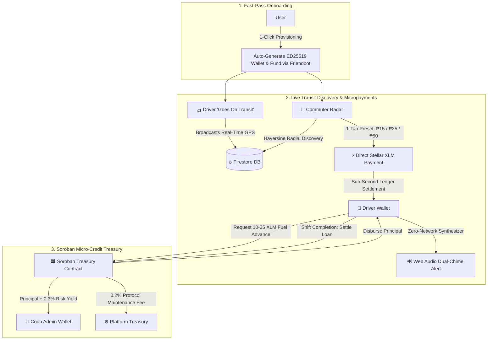
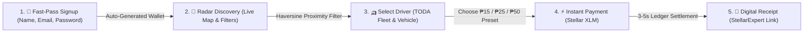
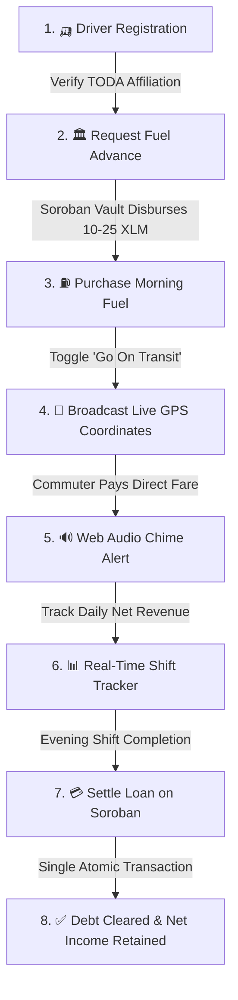
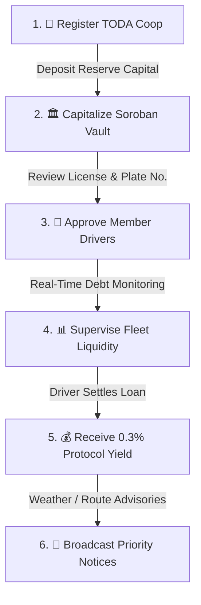
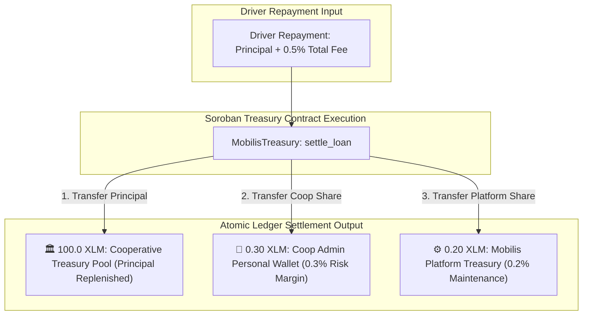

# 📊 Mobilis Architecture & Role-Based Flowcharts

> Comprehensive system, role-by-role user journeys, and Soroban smart contract state flowcharts for **Mobilis**.

---

## 🧭 Table of Contents
1. [MVP Core System Loop](#1-mvp-core-system-loop)
2. [Commuter Transit Journey](#2-commuter-transit-journey)
3. [Driver Operations & Micro-Credit Journey](#3-driver-operations--micro-credit-journey)
4. [Cooperative Admin Governance & Treasury Journey](#4-cooperative-admin-governance--treasury-journey)
5. [Soroban Smart Contract & Atomic Fee Routing State Machine](#5-soroban-smart-contract--atomic-fee-routing-state-machine)

---

## 1. 🚀 MVP Core System Loop

---

## 2. 🚶 Commuter Transit Journey

---

## 3. 🛺 Driver Operations & Micro-Credit Journey

---

## 4. 🏢 Cooperative Admin Governance & Treasury Journey

---

## 5. 📜 Soroban Smart Contract & Atomic Fee Routing State Machine

