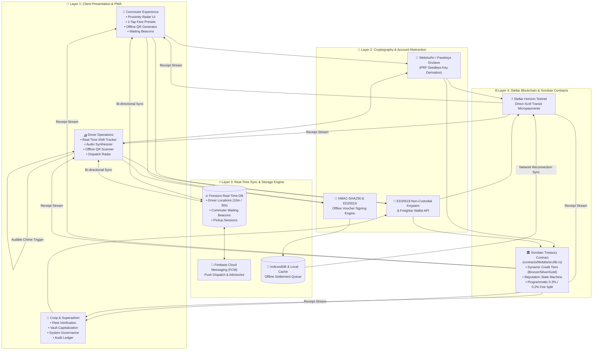
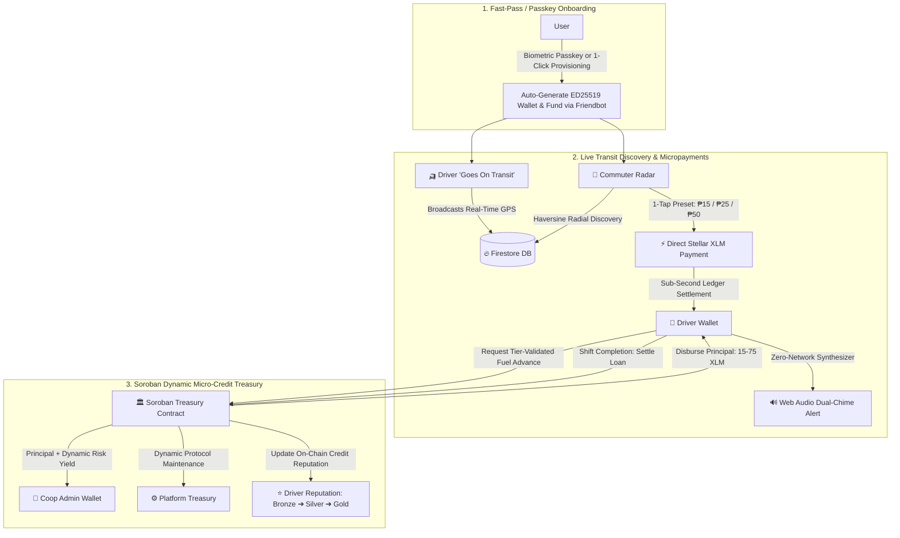
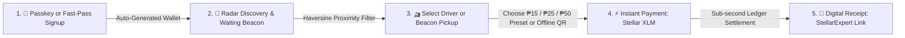
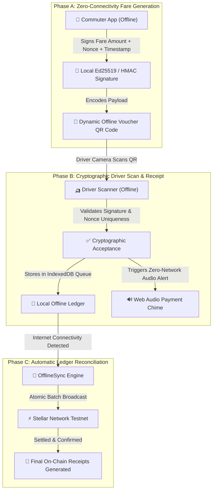
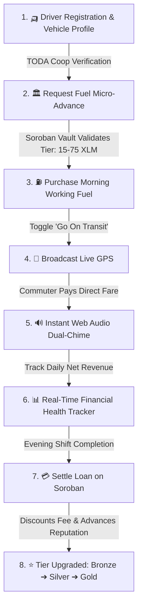
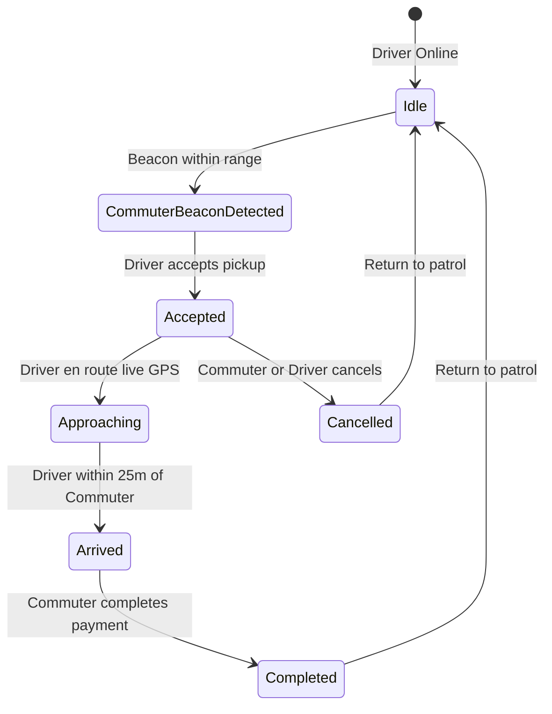
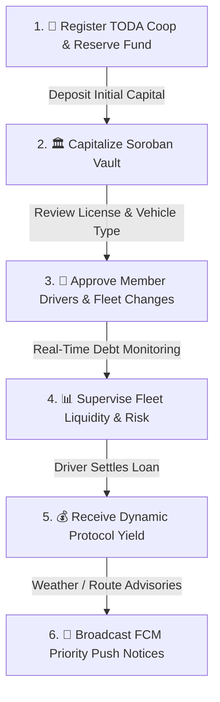
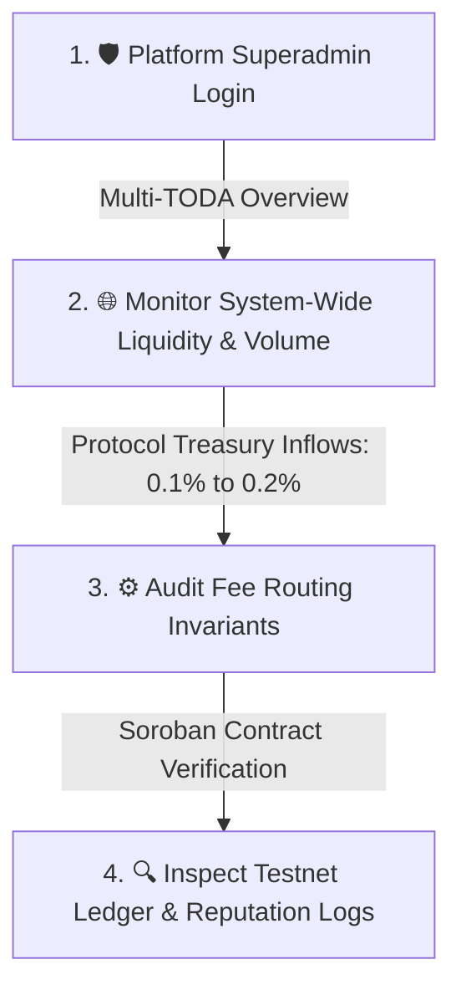
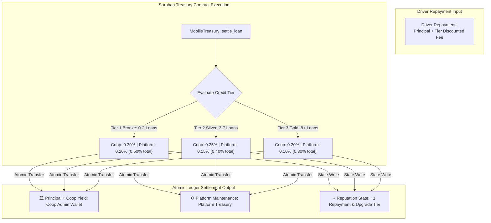

# 📊 Mobilis Architecture & Role-Based Flowcharts

> Comprehensive system, role-by-role user journeys, offline voucher engines, and Soroban smart contract state flowcharts for **Mobilis**.

---

## 🧭 Table of Contents
1. [End-to-End Multi-Layer System Architecture](#1-end-to-end-multi-layer-system-architecture)
2. [MVP Core System Loop](#2-mvp-core-system-loop)
3. [Commuter Transit & Beacon Journey](#3-commuter-transit--beacon-journey)
4. [Offline-First Cryptographic Micropayment Pipeline](#4-offline-first-cryptographic-micropayment-pipeline)
5. [Driver Operations & Tiered Micro-Credit Journey](#5-driver-operations--tiered-micro-credit-journey)
6. [Driver Pickup Dispatch & Approach State Machine](#6-driver-pickup-dispatch--approach-state-machine)
7. [Cooperative Admin Governance & Treasury Journey](#7-cooperative-admin-governance--treasury-journey)
8. [Platform Superadmin System Governance](#8-platform-superadmin-system-governance)
9. [Soroban Dynamic Credit Tier & Atomic Fee Routing State Machine](#9-soroban-dynamic-credit-tier--atomic-fee-routing-state-machine)

---

## 1. 🏛️ End-to-End Multi-Layer System Architecture

---

## 2. 🚀 MVP Core System Loop

---

## 3. 🚶 Commuter Transit & Beacon Journey

---

## 4. 📴 Offline-First Cryptographic Micropayment Pipeline

---

## 5. 🛺 Driver Operations & Tiered Micro-Credit Journey

---

## 6. 🛺 Driver Pickup Dispatch & Approach State Machine

---

## 7. 🏢 Cooperative Admin Governance & Treasury Journey

---

## 8. 🛡️ Platform Superadmin System Governance

---

## 9. 📜 Soroban Dynamic Credit Tier & Atomic Fee Routing State Machine

