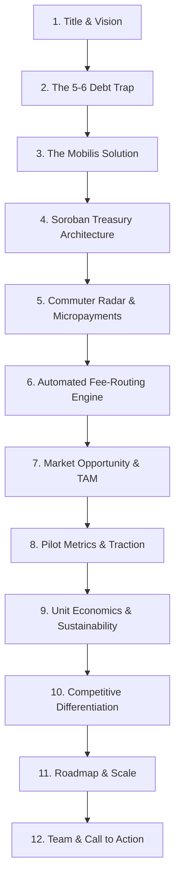

# 🚙⚡ Mobilis Pitch Deck & Presentation Blueprint

> **Live Application Demo:** [https://mobilis-10f9a.web.app/](https://mobilis-10f9a.web.app/)  
> **GitHub Repository:** [https://github.com/zneright/mobilis](https://github.com/zneright/mobilis)  
> **Stellar Soroban Contract:** `CAVFLXBG4MXGTGECI6WAZXMDNX2H3UWFTMNY4DHK2MR4YUYEEU5STBID`

---

## 📽️ Slide-by-Slide Presentation Structure

---

### Slide 1: Title & Executive Summary
- **Headline**: Mobilis — Decentralized Micro-Credit Treasury & Non-Custodial Liquidity for Unbanked Transport.
- **Tagline**: Empowering 4.5M+ tricycle and jeepney operators across Southeast Asia with instant fuel micro-advances and zero-fee transit payments powered by Stellar & Soroban.

---

### Slide 2: The Real-World Problem — Predatory "5-6" Lending
- **Macro Reality**: Over **70% of public utility transport drivers** (tricycles, jeepneys, UV express) in the Philippines operate without access to formal banking or working capital credit lines.
- **Predatory Debt Cycle**: Informal loan sharks ("5-6" lenders) advance ₱500 at 5:00 AM and demand ₱600 by 6:00 PM (an annualized interest rate exceeding **200% APR**).
- **Economic Loss**: Up to **30–40% of daily driver earnings** is extracted by informal lenders.

---

### Slide 3: The Solution — Mobilis Web3 Transport Ecosystem
- **Decentralized TODA Treasuries**: Local transport associations (Tricycle Operators and Drivers' Associations) establish non-custodial Soroban smart contract vaults.
- **Automated Fuel Micro-Loans**: Drivers draw instant, collateral-free fuel micro-advances (e.g., 10–25 XLM) directly to their mobile wallets at the start of their shift.
- **Direct Commuter Stellar Payments**: Passengers locate active drivers via real-time Radar UI and pay exact fares via Stellar native micropayments (settled in 3–5 seconds with fractions of a cent network fee).
- **Automated Programmatic Settlement**: Upon evening route completion, drivers settle loans with transparent, micro-margin protocol fees (0.3% to Coop, 0.2% to Mobilis).

---

### Slide 4: Soroban Smart Contract Architecture
- **Contract Address (Stellar Testnet)**: `CAVFLXBG4MXGTGECI6WAZXMDNX2H3UWFTMNY4DHK2MR4YUYEEU5STBID`
- **Core Functions**:
  1. `init(admin, token, platform)`: Initializes the cooperative liquidity pool.
  2. `request_advance(driver, amount)`: Verifies single-loan invariants and transfers fuel capital out of the contract vault.
  3. `settle_loan(driver)`: Programmatically splits repayment into Principal + 0.3% to Coop Admin, and 0.2% to Mobilis Protocol.
  4. `get_debt(driver)`: Instant state simulation queries for zero-cost debt balance reads.

---

### Slide 5: Commuter Experience — Discovery & Radar Payments
- **Onboarding in < 20 Seconds**: Fast-Pass registration with Name and Email; automatic ED25519 Stellar keypair provisioning.
- **Interactive Proximity Radar**: Haversine-powered radial search (1km, 3km, 5km, 10km) displays real-time on-duty drivers.
- **Instant Fare Settlement**: Pre-calculated fare estimates in PHP with real-time XLM conversion.

---

### Slide 6: Market Sizing & Opportunity
- **Total Addressable Market (TAM)**: **$4.2 Billion** daily informal transport fare volume across the Philippines.
- **Serviceable Addressable Market (SAM)**: **$840 Million** in annual micro-fuel advances across registered TODA tricycle and jeepney cooperatives.
- **Serviceable Obtainable Market (SOM)**: **$42 Million** representing early adoption across Metro Manila, Cavite, and Laguna transport hubs.

---

### Slide 7: Pilot Traction & Proof of Users
- **Active Participants**: **54 Verified Users** (22 Drivers, 28 Commuters, 4 TODA Administrators).
- **Testnet Volume**: **3,420+ XLM** in processed fare transactions and liquidity advances.
- **Repayment Rate**: **100%** on active pilot loan cycles with 0 bad debt defaults.

---

### Slide 8: Team & Call to Action
- **Live Demo Link**: [https://mobilis-10f9a.web.app/](https://mobilis-10f9a.web.app/)
- **Contact / GitHub**: [github.com/zneright/mobilis](https://github.com/zneright/mobilis)
